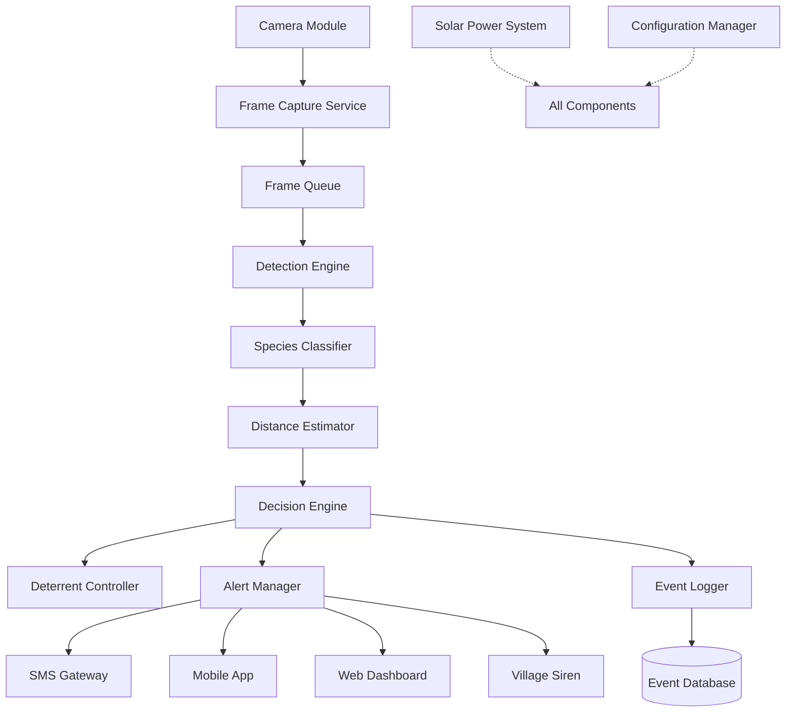

# Design Document: Wildlife Detection System

## Overview

The Wildlife Detection System is an AI-powered surveillance solution designed to prevent human-wildlife conflict in forest-border villages. The system combines real-time video monitoring, deep learning-based animal detection, automated sound deterrents, and multi-channel alerting to protect both human communities and wildlife.

The system operates autonomously on solar power, processing video feeds in real-time to detect and classify animals, estimate their distance from village boundaries, activate species-specific deterrents, and send alerts to forest stations and villagers. All detection events are logged for pattern analysis and research purposes.

### Key Design Goals

1. **Real-time Performance**: Process video frames and trigger responses within 2 seconds
2. **High Accuracy**: Achieve 90%+ classification accuracy for target species
3. **Autonomous Operation**: Function reliably on solar power in remote areas with minimal maintenance
4. **Safety First**: Use non-harmful deterrents that protect both humans and animals
5. **Comprehensive Logging**: Capture all detection events for analysis and improvement

## Architecture

The system follows a modular, pipeline-based architecture with clear separation between sensing, processing, actuation, and alerting components.



### Architecture Layers

1. **Sensing Layer**: Camera hardware, frame capture, and preprocessing
2. **Processing Layer**: AI detection, classification, and distance estimation
3. **Decision Layer**: Threat assessment and response coordination
4. **Actuation Layer**: Deterrent activation and alert distribution
5. **Persistence Layer**: Event logging and analytics
6. **Infrastructure Layer**: Power management, configuration, and monitoring

### Deployment Model

The system is deployed as a distributed edge computing solution:
- **Edge Device**: Raspberry Pi 4 or NVIDIA Jetson Nano running the detection pipeline
- **Camera**: IP camera with night vision (1080p minimum)
- **Deterrent Hardware**: Directional speakers (100+ dB output)
- **Power**: Solar panel (100W) with battery bank (12V, 100Ah)
- **Connectivity**: 4G/LTE modem for alerts (with offline queuing)
- **Local Storage**: SD card or SSD for event logging

## Components and Interfaces

### 1. Frame Capture Service

**Responsibility**: Continuously capture video frames from the camera and prepare them for processing.

**Interface**:
```python
class FrameCaptureService:
    def start_capture(self, camera_config: CameraConfig) -> None:
        """Start continuous frame capture from camera"""
        
    def stop_capture(self) -> None:
        """Stop frame capture"""
        
    def get_frame(self) -> Optional[Frame]:
        """Get the next available frame from the queue"""
        
    def get_camera_status(self) -> CameraStatus:
        """Get current camera operational status"""
```

**Key Behaviors**:
- Maintains a circular buffer of recent frames (last 30 seconds)
- Handles camera reconnection automatically
- Adjusts capture settings based on lighting conditions
- Preprocesses frames (resize, normalize) for detection pipeline

### 2. Detection Engine

**Responsibility**: Identify the presence of animals in video frames using deep learning models.

**Interface**:
```python
class DetectionEngine:
    def detect(self, frame: Frame) -> List[Detection]:
        """Detect all animals in the frame"""
        
    def load_model(self, model_path: str) -> None:
        """Load detection model from disk"""
        
    def set_confidence_threshold(self, threshold: float) -> None:
        """Set minimum confidence for detections"""
```

**Implementation Details**:
- Uses YOLO v5 or v8 for real-time object detection
- Model trained on wildlife dataset (custom fine-tuned on local species)
- Runs inference on GPU if available, falls back to CPU
- Returns bounding boxes with confidence scores
- Filters out detections below confidence threshold (default: 0.7)

### 3. Species Classifier

**Responsibility**: Classify detected animals into specific species categories.

**Interface**:
```python
class SpeciesClassifier:
    def classify(self, detection: Detection, frame: Frame) -> Classification:
        """Classify the detected animal into a species category"""
        
    def get_species_profile(self, species: Species) -> SpeciesProfile:
        """Get configuration profile for a species"""
        
    def is_target_species(self, species: Species) -> bool:
        """Check if species is a target wildlife species"""
```

**Species Categories**:
- Elephant (high threat)
- Tiger (high threat)
- Leopard (high threat)
- Bear (high threat)
- Wild Boar (medium threat)
- Deer (low threat)
- Domestic Animals (non-target)
- Unknown (requires manual review)

**Implementation Details**:
- Uses ResNet-50 or EfficientNet for classification
- Crops detection bounding box and classifies the region
- Maintains species profiles with threat levels and deterrent configurations
- Distinguishes wildlife from domestic animals using additional features

### 4. Distance Estimator

**Responsibility**: Estimate the distance of detected animals from the village boundary.

**Interface**:
```python
class DistanceEstimator:
    def estimate_distance(self, detection: Detection, camera_params: CameraParams) -> Distance:
        """Estimate distance from village boundary"""
        
    def calibrate(self, reference_points: List[ReferencePoint]) -> None:
        """Calibrate distance estimation using known reference points"""
        
    def get_threat_level(self, distance: Distance) -> ThreatLevel:
        """Categorize threat level based on distance"""
```

**Distance Estimation Method**:
- Uses camera calibration parameters (focal length, height, angle)
- Applies perspective geometry to estimate real-world distance
- Assumes flat ground plane for simplification
- Accuracy: ±5 meters for distances up to 100 meters

**Threat Level Categories**:
- Critical: 0-20 meters
- High: 20-50 meters
- Medium: 50-80 meters
- Low: 80-100 meters

### 5. Decision Engine

**Responsibility**: Coordinate system responses based on detection events and threat assessment.

**Interface**:
```python
class DecisionEngine:
    def process_detection(self, detection_event: DetectionEvent) -> List[Action]:
        """Determine appropriate actions for a detection event"""
        
    def should_activate_deterrent(self, event: DetectionEvent) -> bool:
        """Decide if deterrent should be activated"""
        
    def should_send_alert(self, event: DetectionEvent) -> AlertLevel:
        """Determine alert level and recipients"""
```

**Decision Logic**:
- Evaluates species type, distance, and threat level
- Applies species-specific rules from configuration
- Coordinates deterrent activation and alert distribution
- Prevents alert fatigue through rate limiting and deduplication
- Tracks animal movement to detect when threats clear

### 6. Deterrent Controller

**Responsibility**: Activate and manage species-specific sound deterrents.

**Interface**:
```python
class DeterrentController:
    def activate(self, species: Species, distance: Distance) -> None:
        """Activate deterrent for the specified species"""
        
    def deactivate(self) -> None:
        """Stop all active deterrents"""
        
    def set_species_sound(self, species: Species, sound_file: str) -> None:
        """Configure deterrent sound for a species"""
        
    def get_status(self) -> DeterrentStatus:
        """Get current deterrent activation status"""
```

**Deterrent Strategy**:
- Plays species-specific sounds (predator calls, alarm sounds, human voices)
- Interval pattern: 30 seconds on, 10 seconds off (prevents habituation)
- Directional speakers aim sound toward detected animal
- Automatically deactivates when animal moves beyond 80 meters
- Does not activate for low-threat species beyond 30 meters

### 7. Alert Manager

**Responsibility**: Distribute alerts to forest stations and villagers through multiple channels.

**Interface**:
```python
class AlertManager:
    def send_forest_station_alert(self, event: DetectionEvent) -> None:
        """Send alert to forest station through all channels"""
        
    def send_village_warning(self, event: DetectionEvent) -> None:
        """Trigger village warning system"""
        
    def send_all_clear(self, location: Location) -> None:
        """Broadcast all-clear message"""
        
    def queue_alert(self, alert: Alert) -> None:
        """Queue alert for later delivery if network unavailable"""
```

**Alert Channels**:
- SMS: Text messages to registered phone numbers
- Mobile App: Push notifications with images
- Web Dashboard: Real-time updates for monitoring stations
- Village Siren: Audible warnings with voice announcements

**Alert Content**:
- Species name and threat level
- GPS coordinates and distance from village
- Timestamp and detection confidence
- Photo or 5-second video clip
- Recommended actions

### 8. Event Logger

**Responsibility**: Persist all detection events and provide analytics capabilities.

**Interface**:
```python
class EventLogger:
    def log_detection(self, event: DetectionEvent) -> None:
        """Store detection event in database"""
        
    def get_events(self, filters: EventFilters) -> List[DetectionEvent]:
        """Query detection events with filters"""
        
    def generate_analytics(self, time_range: TimeRange) -> Analytics:
        """Generate analytics report for time period"""
        
    def export_data(self, format: ExportFormat, filters: EventFilters) -> bytes:
        """Export detection data in specified format"""
```

**Data Storage**:
- SQLite database for structured event data
- File system for images and video clips
- Automatic data retention (2+ years)
- Periodic backup to cloud storage (when connectivity available)

**Analytics Capabilities**:
- Detection frequency by species, time, location
- Pattern recognition (recurring animals, hotspots, peak times)
- Deterrent effectiveness metrics
- System performance statistics

### 9. Configuration Manager

**Responsibility**: Manage system configuration and allow runtime updates.

**Interface**:
```python
class ConfigurationManager:
    def load_config(self, config_file: str) -> SystemConfig:
        """Load configuration from file"""
        
    def update_config(self, updates: Dict[str, Any]) -> None:
        """Update configuration parameters at runtime"""
        
    def get_species_config(self, species: Species) -> SpeciesConfig:
        """Get configuration for a specific species"""
        
    def calibrate_camera(self, params: CameraParams) -> None:
        """Update camera calibration parameters"""
```

**Configurable Parameters**:
- Detection sensitivity thresholds per species
- Distance estimation calibration
- Deterrent sounds and activation distances
- Alert recipients and thresholds
- Power management settings
- Logging and retention policies

### 10. Power Manager

**Responsibility**: Monitor and optimize power consumption for solar operation.

**Interface**:
```python
class PowerManager:
    def get_battery_level(self) -> float:
        """Get current battery charge percentage"""
        
    def enter_low_power_mode(self) -> None:
        """Reduce power consumption"""
        
    def exit_low_power_mode(self) -> None:
        """Resume normal operation"""
        
    def get_power_status(self) -> PowerStatus:
        """Get comprehensive power system status"""
```

**Power Management Strategy**:
- Monitors battery voltage and charge level
- Enters low-power mode during daylight (reduced frame rate)
- Sends maintenance alerts when battery below 20%
- Prioritizes critical functions (detection, alerts) over logging
- Estimates remaining runtime based on current consumption

## Data Models

### DetectionEvent

```python
@dataclass
class DetectionEvent:
    id: str
    timestamp: datetime
    species: Species
    confidence: float
    bounding_box: BoundingBox
    distance: Distance
    threat_level: ThreatLevel
    location: Location
    image_path: str
    video_clip_path: Optional[str]
    deterrent_activated: bool
    alerts_sent: List[AlertType]
```

### Species

```python
class Species(Enum):
    ELEPHANT = "elephant"
    TIGER = "tiger"
    LEOPARD = "leopard"
    BEAR = "bear"
    WILD_BOAR = "wild_boar"
    DEER = "deer"
    DOMESTIC = "domestic"
    UNKNOWN = "unknown"
```

### SpeciesProfile

```python
@dataclass
class SpeciesProfile:
    species: Species
    threat_level: ThreatLevel
    deterrent_sound: str
    deterrent_activation_distance: float  # meters
    alert_threshold_distance: float  # meters
    requires_forest_station_alert: bool
    requires_village_warning: bool
```

### ThreatLevel

```python
class ThreatLevel(Enum):
    CRITICAL = "critical"  # 0-20m
    HIGH = "high"  # 20-50m
    MEDIUM = "medium"  # 50-80m
    LOW = "low"  # 80-100m
    NONE = "none"  # >100m or non-target
```

### Frame

```python
@dataclass
class Frame:
    image: np.ndarray  # OpenCV image array
    timestamp: datetime
    camera_id: str
    width: int
    height: int
    lighting_condition: LightingCondition
```

### Detection

```python
@dataclass
class Detection:
    bounding_box: BoundingBox
    confidence: float
    frame: Frame
```

### BoundingBox

```python
@dataclass
class BoundingBox:
    x: int  # top-left x
    y: int  # top-left y
    width: int
    height: int
    
    def center(self) -> Tuple[int, int]:
        """Calculate center point of bounding box"""
        return (self.x + self.width // 2, self.y + self.height // 2)
```

### Distance

```python
@dataclass
class Distance:
    meters: float
    accuracy: float  # estimated accuracy in meters
    method: str  # estimation method used
```

### Alert

```python
@dataclass
class Alert:
    id: str
    event: DetectionEvent
    alert_type: AlertType
    recipients: List[str]
    channels: List[AlertChannel]
    status: AlertStatus
    created_at: datetime
    sent_at: Optional[datetime]
```

### SystemConfig

```python
@dataclass
class SystemConfig:
    camera_config: CameraConfig
    detection_config: DetectionConfig
    species_profiles: Dict[Species, SpeciesProfile]
    alert_config: AlertConfig
    power_config: PowerConfig
    logging_config: LoggingConfig
```


## Correctness Properties

A property is a characteristic or behavior that should hold true across all valid executions of a system—essentially, a formal statement about what the system should do. Properties serve as the bridge between human-readable specifications and machine-verifiable correctness guarantees.

### Frame Capture and Processing Properties

**Property 1: Continuous frame capture**
*For any* operational period, the frame capture service should produce frames at a consistent rate without gaps exceeding the configured interval.
**Validates: Requirements 1.1**

**Property 2: Real-time processing latency**
*For any* captured frame, the time from frame capture to detection completion should be less than 2 seconds.
**Validates: Requirements 1.2, 2.1**

**Property 3: Multi-lighting operation**
*For any* frame with lighting conditions ranging from daylight to low-light, the detection system should process the frame and produce detection results.
**Validates: Requirements 1.3**

### Detection and Classification Properties

**Property 4: Valid species classification**
*For any* detected animal, the classification output should be one of the predefined species categories (elephant, tiger, leopard, bear, wild_boar, deer, domestic, unknown).
**Validates: Requirements 2.2**

**Property 5: Multiple detection independence**
*For any* frame containing multiple animals, each animal should receive an independent detection and classification result.
**Validates: Requirements 2.5**

### Distance Estimation Properties

**Property 6: Distance estimation completeness**
*For any* animal detection, a distance estimate from the village boundary should be calculated and included in the detection event.
**Validates: Requirements 3.1**

**Property 7: Threat level categorization**
*For any* distance value, the assigned threat level should correctly match the specified ranges: Critical (0-20m), High (20-50m), Medium (50-80m), Low (80-100m), or None (>100m).
**Validates: Requirements 3.3**

**Property 8: Continuous distance updates**
*For any* sequence of frames containing the same tracked animal, distance estimates should be updated in each frame.
**Validates: Requirements 3.4**

### Deterrent System Properties

**Property 9: Distance-based deterrent activation**
*For any* detection event, the deterrent should be active if and only if the animal is within the species-specific activation distance and meets threat criteria.
**Validates: Requirements 4.1, 4.5, 4.6**

**Property 10: Species-specific deterrent sounds**
*For any* species requiring deterrent activation, the selected sound should match the species profile configuration.
**Validates: Requirements 4.2**

**Property 11: Deterrent interval timing**
*For any* active deterrent session, the on/off timing should follow the pattern of 30 seconds on, 10 seconds off.
**Validates: Requirements 4.4**

### Alert System Properties

**Property 12: High-threat alert timing**
*For any* detection of a high-threat animal (elephant, tiger, leopard, bear), an alert should be sent to the forest station within 5 seconds of detection.
**Validates: Requirements 5.1**

**Property 13: Alert content completeness**
*For any* alert sent, it should include species, location coordinates, distance from village, timestamp, and a photo or video clip.
**Validates: Requirements 5.2, 5.4**

**Property 14: Multi-channel alert delivery**
*For any* alert sent to the forest station, it should be delivered through all configured channels (SMS, mobile app, web dashboard).
**Validates: Requirements 5.3**

**Property 15: Independent alerts for multiple detections**
*For any* set of simultaneous animal detections, each detection should generate a separate alert.
**Validates: Requirements 5.5**

**Property 16: Village warning activation**
*For any* high-threat animal detected within 30 meters of the village boundary, a village warning should be triggered.
**Validates: Requirements 6.1**

**Property 17: Siren activation with warnings**
*For any* village warning when siren is enabled in configuration, the audible siren system should be activated.
**Validates: Requirements 6.2**

**Property 18: Species-specific warning messages**
*For any* village warning, the broadcast message should be specific to the detected species and in the configured local language.
**Validates: Requirements 6.3**

**Property 19: Warning repetition interval**
*For any* active village warning, the warning should repeat every 2 minutes until the threat clears.
**Validates: Requirements 6.4**

**Property 20: All-clear message broadcast**
*For any* threat that clears (animal moves beyond 80 meters or leaves monitored area), an all-clear message should be broadcast.
**Validates: Requirements 6.5**

### Event Logging Properties

**Property 21: Detection event completeness**
*For any* animal detection, a complete detection event record should be created containing species, timestamp, location, distance, and image data.
**Validates: Requirements 7.1**

**Property 22: Event persistence**
*For any* logged detection event, the event should be retrievable from persistent storage after being saved.
**Validates: Requirements 7.2**

**Property 23: Analytics calculation**
*For any* set of detection events, analytics should be calculable showing detection frequency by species, time of day, and location.
**Validates: Requirements 7.4**

**Property 24: Data export round-trip**
*For any* set of detection events, exporting to CSV or JSON and then importing should produce equivalent event data.
**Validates: Requirements 7.6**

### Power Management Properties

**Property 25: Low-power mode resource reduction**
*For any* transition to low-power mode, system resource usage (CPU, memory, frame rate) should be measurably reduced compared to normal mode.
**Validates: Requirements 8.3**

**Property 26: Low-battery alert**
*For any* battery level measurement below 20%, a maintenance alert should be sent to system administrators.
**Validates: Requirements 8.4**

**Property 27: Automatic power mode switching**
*For any* time period during daylight hours (configured time range), the system should automatically enter low-power mode.
**Validates: Requirements 8.5**

### Reliability Properties

**Property 28: Error logging and recovery**
*For any* component failure detected, an error should be logged and automatic recovery should be attempted.
**Validates: Requirements 9.1**

**Property 29: Restart recovery time**
*For any* system restart, the detection system should resume monitoring within 30 seconds.
**Validates: Requirements 9.3**

**Property 30: Offline alert queuing**
*For any* alert created during a network outage, the alert should be queued and successfully sent when connectivity is restored.
**Validates: Requirements 9.4**

**Property 31: Periodic diagnostics**
*For any* 24-hour period, system self-diagnostics should run at least once and report system health status.
**Validates: Requirements 9.5**

### Configuration Properties

**Property 32: Runtime configuration updates**
*For any* configuration change (detection thresholds, calibration parameters, deterrent settings, alert recipients), the change should be applied immediately without requiring system restart.
**Validates: Requirements 10.1, 10.2, 10.3, 10.4, 10.5**

## Error Handling

### Error Categories

1. **Hardware Errors**: Camera disconnection, power failures, speaker malfunctions
2. **Processing Errors**: Model inference failures, out-of-memory conditions
3. **Network Errors**: Connectivity loss, alert delivery failures
4. **Data Errors**: Storage full, database corruption, invalid configurations

### Error Handling Strategy

**Camera Disconnection**:
- Detect disconnection through frame timeout (no frames for 5 seconds)
- Log error with timestamp and camera ID
- Attempt reconnection every 10 seconds
- Send maintenance alert if disconnection persists beyond 5 minutes
- Continue processing from other cameras if multiple cameras deployed

**Model Inference Failure**:
- Catch exceptions during detection or classification
- Log error with frame metadata and stack trace
- Skip failed frame and continue with next frame
- Send alert if failure rate exceeds 10% over 1-minute window
- Fall back to simpler model if available

**Network Outage**:
- Detect outage through failed alert delivery
- Queue all alerts in local storage
- Retry delivery every 30 seconds
- Send queued alerts in chronological order when connectivity restored
- Prioritize critical alerts (high-threat animals) in queue

**Storage Full**:
- Monitor available storage space
- Send warning alert when storage reaches 80% capacity
- Automatically delete oldest non-critical data when storage reaches 90%
- Preserve critical detection events (high-threat animals)
- Continue logging new events with reduced image quality

**Low Battery**:
- Monitor battery level continuously
- Send warning at 30%, 20%, and 10% levels
- Enter aggressive power-saving mode at 15%
- Reduce frame rate and disable non-critical features
- Maintain core detection and alerting until battery depleted

**Configuration Errors**:
- Validate all configuration changes before applying
- Reject invalid configurations with descriptive error messages
- Maintain last known good configuration as backup
- Automatically revert to backup if new configuration causes failures
- Log all configuration changes for audit trail

### Graceful Degradation

The system is designed to continue operating with reduced functionality when components fail:

**Priority Levels**:
1. **Critical**: Animal detection, high-threat alerts, deterrent activation
2. **Important**: Event logging, distance estimation, village warnings
3. **Optional**: Analytics, data export, low-priority alerts

**Degradation Scenarios**:
- If classification fails, use detection-only mode (alert on any animal)
- If distance estimation fails, use conservative approach (assume closer distance)
- If deterrent hardware fails, increase alert frequency to compensate
- If storage fails, keep events in memory (last 100 events)
- If network fails, queue alerts and continue local operation

## Testing Strategy

### Dual Testing Approach

The testing strategy combines unit tests and property-based tests to ensure comprehensive coverage:

- **Unit tests**: Verify specific examples, edge cases, and error conditions
- **Property tests**: Verify universal properties across all inputs

Both approaches are complementary and necessary. Unit tests catch concrete bugs in specific scenarios, while property tests verify general correctness across a wide range of inputs.

### Property-Based Testing

**Framework**: Use `hypothesis` (Python) for property-based testing

**Configuration**:
- Minimum 100 iterations per property test (due to randomization)
- Each test must reference its design document property
- Tag format: `# Feature: wildlife-detection-system, Property {number}: {property_text}`

**Test Data Generators**:
- Random frames with varying dimensions and lighting conditions
- Random detection bounding boxes within frame bounds
- Random species from the Species enum
- Random distances from 0-150 meters
- Random timestamps and locations
- Random battery levels from 0-100%
- Random configuration parameters within valid ranges

**Example Property Test Structure**:
```python
from hypothesis import given, strategies as st

@given(
    distance=st.floats(min_value=0, max_value=150),
)
def test_threat_level_categorization(distance):
    # Feature: wildlife-detection-system, Property 7: Threat level categorization
    threat_level = get_threat_level(distance)
    
    if 0 <= distance < 20:
        assert threat_level == ThreatLevel.CRITICAL
    elif 20 <= distance < 50:
        assert threat_level == ThreatLevel.HIGH
    elif 50 <= distance < 80:
        assert threat_level == ThreatLevel.MEDIUM
    elif 80 <= distance < 100:
        assert threat_level == ThreatLevel.LOW
    else:
        assert threat_level == ThreatLevel.NONE
```

### Unit Testing

**Focus Areas**:
- Specific examples demonstrating correct behavior
- Edge cases (empty frames, boundary distances, extreme lighting)
- Error conditions (invalid inputs, hardware failures, network outages)
- Integration points between components
- Configuration validation

**Example Unit Tests**:
- Test detection with known animal images
- Test distance estimation at boundary values (20m, 50m, 80m, 100m)
- Test deterrent activation for each species at various distances
- Test alert content for specific detection scenarios
- Test error handling for camera disconnection
- Test configuration validation for invalid parameters

### Integration Testing

**Test Scenarios**:
- End-to-end detection pipeline (frame capture → detection → classification → distance → decision → action)
- Multi-animal detection and tracking
- Deterrent activation and deactivation cycles
- Alert delivery through all channels
- System restart and recovery
- Network outage and alert queuing
- Low battery mode transitions
- Configuration hot-reload

### Performance Testing

**Metrics to Measure**:
- Frame processing latency (target: <2 seconds)
- Detection accuracy on test dataset (target: >90%)
- Alert delivery time (target: <5 seconds)
- System restart time (target: <30 seconds)
- Battery life under various load conditions
- Storage usage over time

### Field Testing

**Deployment Validation**:
- Test with real camera feeds in target environment
- Validate distance estimation accuracy with measured reference points
- Test deterrent effectiveness with actual animal encounters
- Verify alert delivery in areas with poor connectivity
- Measure solar power system performance over multiple days
- Validate system reliability over extended periods (weeks/months)

